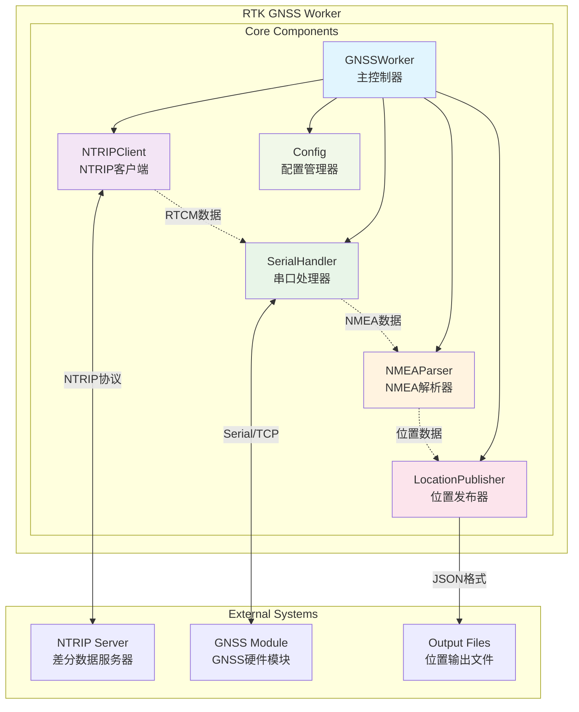
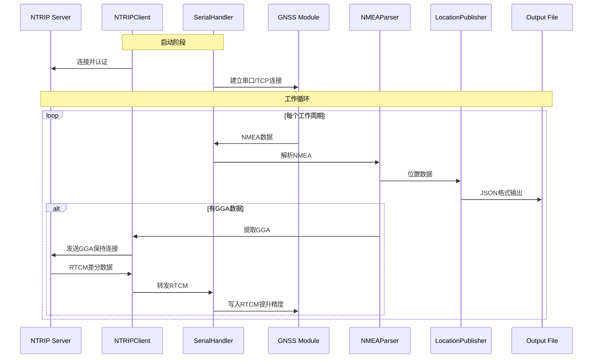
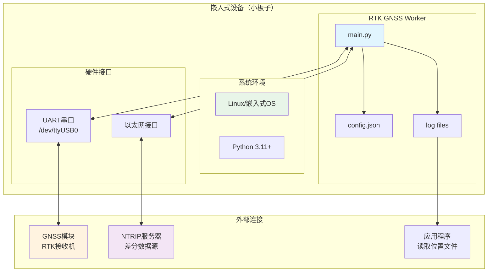
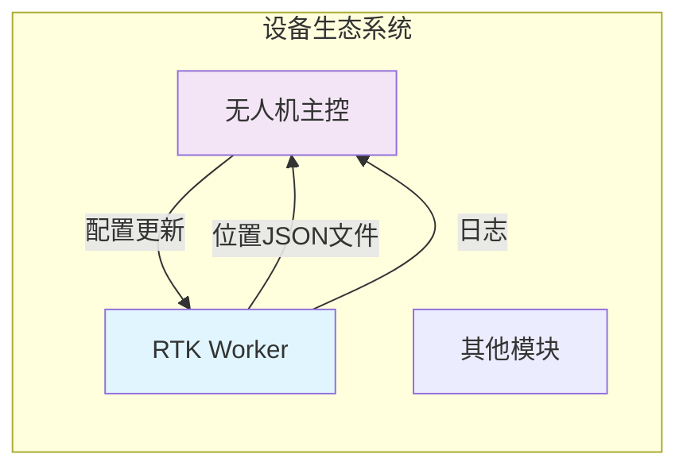

# 系统设计方案

## 1. 整体架构设计

### 1.1 架构概览



### 1.2 核心设计原则

1. **简洁高效**：专为嵌入式设备优化，避免过度设计
2. **资源友好**：最小化内存和CPU占用
3. **容错性强**：网络断线和设备异常自动恢复
4. **配置灵活**：支持文件配置和环境变量
5. **易于部署**：单文件部署，依赖最小化

### 1.3 关键设计决策

| 决策点 | 选择方案 | 理由 |
|--------|---------|------|
| 架构模式 | 简化同步 + 多线程 | 嵌入式环境稳定，减少复杂度 |
| 数据流处理 | 直接处理 | 减少内存缓冲，适合资源受限环境 |
| 错误处理 | 简单重试机制 | 网络和串口自动重连 |
| 配置管理 | 统一Config类 | 兼容uavcli_ird项目配置格式 |
| 日志策略 | 标准Python日志 | 成熟稳定，支持文件轮转 |

## 2. 模块设计

### 2.1 GNSSWorker 主控制器

```python
class GNSSWorker:
    """RTK GNSS工作器 - 简化版本，专为嵌入式设备优化"""
    
    def __init__(self, config: Config):
        """初始化各个组件"""
        
    def start(self) -> None:
        """启动工作器"""
        
    def stop(self) -> None:
        """停止工作器"""
        
    def run_once(self) -> bool:
        """执行一次工作循环"""
```

**职责：**
- 组件生命周期管理
- 简单的工作循环控制
- 异常处理和日志记录
- 线程安全的停止机制

### 2.2 NTRIPClient 网络客户端

```python
class NTRIPClient:
    """NTRIP客户端，负责连接差分数据服务器"""
    
    def connect(self) -> bool:
        """连接到NTRIP服务器"""
        
    def send_gga(self, gga_data: str) -> bool:
        """发送GGA数据保持连接"""
        
    def receive_rtcm(self) -> bytes:
        """接收RTCM差分数据"""
```

**职责：**
- NTRIP协议实现
- HTTP认证和连接管理
- RTCM数据接收
- 网络异常自动重连

### 2.3 SerialHandler 串口/TCP处理器

```python
class SerialHandler:
    """串口/TCP通信模块，支持双模式"""
    
    def write_rtcm(self, rtcm_data: bytes) -> bool:
        """写入RTCM数据到GNSS模块"""
        
    def read_nmea(self) -> Optional[str]:
        """读取NMEA数据"""
        
    def is_connected(self) -> bool:
        """检查连接状态"""
```

**职责：**
- 串口和TCP双模式支持
- RTCM数据写入GNSS模块
- NMEA数据读取
- 连接状态管理

### 2.4 NMEAParser NMEA解析器

```python
class NMEAParser:
    """NMEA数据解析器"""
    
    def parse_gga(self, nmea_line: str) -> Optional[LocationData]:
        """解析GGA语句获取位置信息"""
        
    def extract_gga(self, nmea_line: str) -> Optional[str]:
        """提取GGA语句用于NTRIP"""
```

**职责：**
- NMEA语句解析
- 位置数据提取
- GGA语句格式化
- 数据有效性检查

### 2.5 LocationPublisher 位置发布器

```python
class LocationPublisher:
    """位置数据发布器，支持文件输出"""
    
    def publish(self, location: LocationData) -> bool:
        """发布位置数据"""
```

**职责：**
- 位置数据格式化为JSON
- 原子文件写入
- 数据验证
- 错误处理

## 3. 数据流设计

### 3.1 主要数据流



### 3.2 数据模型

```python
@dataclass
class LocationData:
    """位置数据模型 - 简化版本"""
    timestamp: float      # Unix时间戳
    latitude: float       # 纬度（度）
    longitude: float      # 经度（度）
    altitude: float       # 海拔高度（米）
    quality: int          # GPS质量指示符
    satellites: int       # 可见卫星数
    hdop: float          # 水平精度稀释
    raw_nmea: str        # 原始NMEA语句
```

### 3.3 配置结构

```json
{
  "rtk": {
    "ntrip": {
      "server": "220.180.239.212",
      "port": 7990,
      "username": "QL_NTRIP", 
      "password": "123456",
      "mountpoint": "HeFei",
      "timeout": 30,
      "reconnect_interval": 5,
      "max_retries": 3
    },
    "serial": {
      "port": "/dev/ttyUSB0",
      "baudrate": 115200,
      "timeout": 1.0,
      "host": null
    },
    "output": {
      "type": "file",
      "file_path": "/tmp/gnss_location.json",
      "atomic_write": true,
      "update_interval": 1.0
    },
    "logging": {
      "level": "INFO",
      "file": "/var/log/rtk-gnss-worker.log",
      "max_size": "10MB",
      "backup_count": 5
    }
  }
}
```

## 4. 错误处理策略

### 4.1 错误分类与处理

| 错误类型 | 示例 | 处理策略 | 恢复时间 |
|---------|------|---------|----------|
| 网络错误 | NTRIP连接断开、DNS解析失败 | 指数退避重连 | 5-30秒 |
| 串口错误 | 设备断开、权限错误 | 重新打开连接 | 5秒 |
| 数据错误 | NMEA格式错误、校验失败 | 记录并跳过 | 立即 |
| 文件错误 | 磁盘满、权限不足 | 降级处理 | 立即 |

### 4.2 重连机制

```python
class RetryStrategy:
    """简化的重试策略"""
    
    def __init__(self, max_retries=3, base_delay=5.0):
        self.max_retries = max_retries
        self.base_delay = base_delay
        self.current_retry = 0
    
    def should_retry(self) -> bool:
        """是否应该重试"""
        return self.current_retry < self.max_retries
    
    def get_delay(self) -> float:
        """获取延迟时间（秒）"""
        return self.base_delay * (1 + self.current_retry)
```

## 5. 配置管理

### 5.1 配置优先级

```
Environment Variables  (最高优先级)
       ↓
Configuration File     (config.json中的rtk节)
       ↓  
Default Values        (最低优先级)
```

### 5.2 与uavcli_ird项目集成

本项目的配置完全兼容uavcli_ird项目的config.json格式，通过`rtk`节进行配置：

```python
class Config:
    """统一配置管理器"""
    
    @classmethod
    def from_file(cls, file_path: str) -> 'Config':
        """从文件加载配置，自动识别rtk节"""
        with open(file_path, 'r', encoding='utf-8') as f:
            config_data = json.load(f)
        
        # 如果有rtk节，使用RTK配置；否则使用整个配置
        if 'rtk' in config_data:
            return cls(config_data['rtk'])
        else:
            return cls(config_data)
```

## 6. 性能优化

### 6.1 嵌入式优化策略

- **内存优化**：避免大对象创建，及时释放资源
- **CPU优化**：减少字符串操作，使用预编译正则表达式  
- **IO优化**：非阻塞读取，合理的超时设置
- **功耗优化**：工作循环间适当延迟，避免忙等待

### 6.2 资源监控

| 指标 | 正常范围 | 监控方法 |
|------|---------|----------|
| 内存使用 | < 50MB | 进程监控 |
| CPU使用率 | < 20% | top/htop |
| 网络连接 | 稳定连接 | 日志监控 |
| 文件句柄 | < 10个 | lsof |

## 7. 部署架构

### 7.1 嵌入式设备部署（主要使用场景）



**部署特点：**
- 🎯 **目标环境**：ARM/x86小板子，内存128MB-1GB
- ⚡ **启动方式**：systemd服务、supervisor或直接运行
- 💾 **资源占用**：< 50MB内存，< 5% CPU
- 🔧 **配置方式**：config.json文件或环境变量
- 📁 **文件结构**：单目录部署，所有文件集中管理

### 7.2 开发环境部署

```bash
# 1. 克隆代码
git clone <repository>
cd rtk-gnss-worker

# 2. 安装依赖  
pip install -r requirements.txt

# 3. 配置
cp config.json.example config.json
vim config.json

# 4. 运行
python main.py
```

### 7.3 容器化部署（可选，用于开发测试）

虽然主要部署场景是小板子，但项目也支持容器化部署，主要用于：
- 开发环境统一
- 集成测试 
- Mock服务测试

```dockerfile
FROM python:3.11.6-slim

WORKDIR /app

# 安装系统依赖
RUN apt-get update && apt-get install -y \
    gcc \
    netcat-traditional \
    && rm -rf /var/lib/apt/lists/*

# 复制requirements文件并安装依赖
COPY requirements.txt .
RUN pip install --no-cache-dir -r requirements.txt

# 复制源代码
COPY src/ /app/src/
COPY tests/ /app/tests/
COPY main.py /app/main.py
COPY config.json /app/config.json

# 设置Python路径
ENV PYTHONPATH=/app/src

# 使用tests目录下的entrypoint脚本
ENTRYPOINT ["/app/tests/entrypoint.sh"]
CMD ["gnss-worker"]
```

**注意：** 容器化主要用于开发测试，生产环境建议直接部署到嵌入式设备。

### 7.4 系统集成



**集成要点：**
- 位置数据通过JSON文件共享
- 统一日志管理
- 配置文件集中管理
- 进程监控和自动重启

这份更新后的设计文档现在完全反映了实际的代码结构，使用mermaid图表提供了更清晰的可视化，并针对嵌入式设备部署场景进行了优化说明。

这份设计文档为RTK GNSS Worker项目提供了完整的架构设计和技术方案，确保系统具备高可靠性、良好的可扩展性和易维护性。
