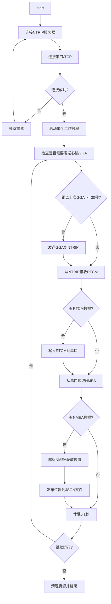
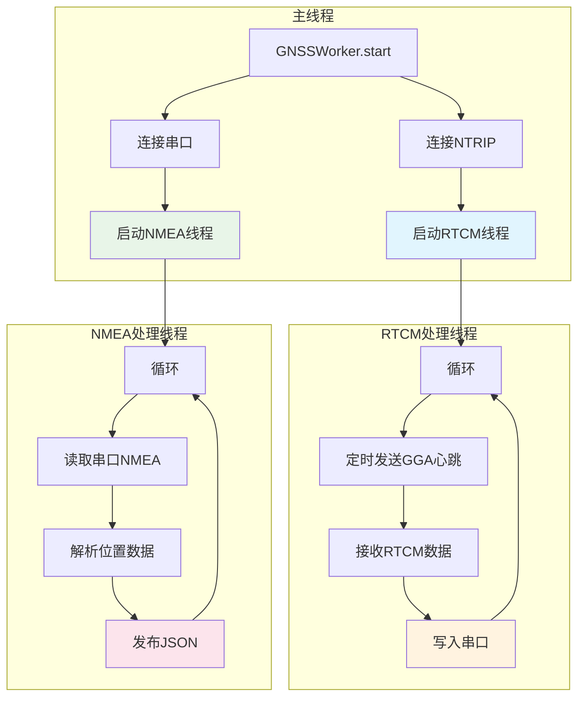
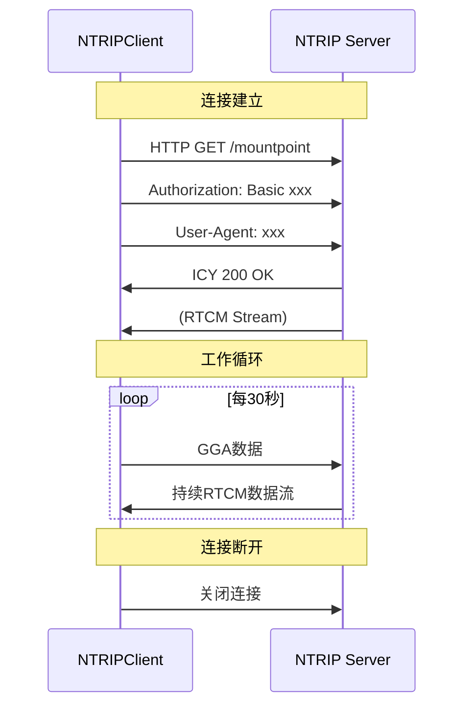
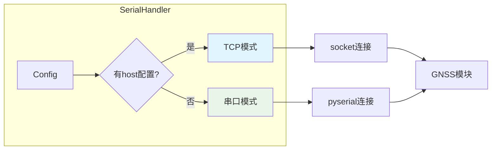
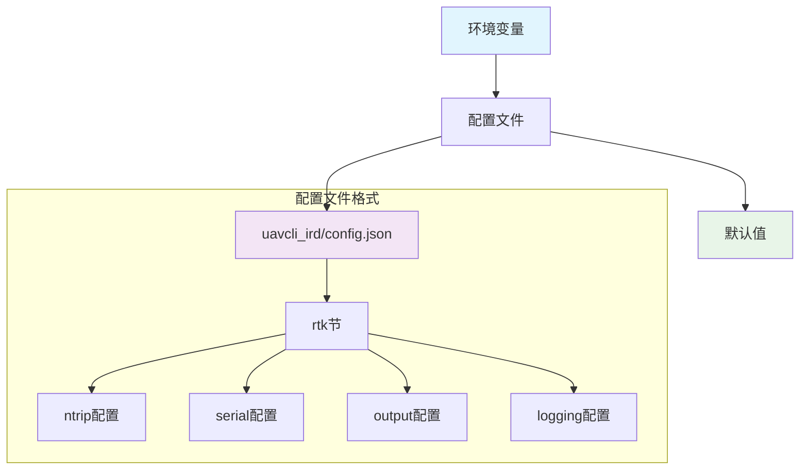

# 模块详细设计

## 1. GNSSWorker 主控制器

### 1.1 类设计

```python
class GNSSWorker:
    """
    RTK GNSS工作器 - 简化版本
    专注于核心功能，优化功耗
    """
    
    def __init__(self, config: Config):
        self.config = config
        self.logger = logging.getLogger(__name__)
        
        # 延迟导入避免循环引用
        from ntrip_client import NTRIPClient
        from serial_handler import SerialHandler
        from nmea_parser import NMEAParser
        from location_publisher import LocationPublisher
        
        # 初始化组件
        self.ntrip_client = NTRIPClient(config.ntrip)
        self.serial_handler = SerialHandler(config.serial)
        self.nmea_parser = NMEAParser()
        self.location_publisher = LocationPublisher(config.output)
        
        # 状态
        self.running = False
        self.last_gga_time = 0
        self.last_location: Optional[LocationData] = None
        
    def start(self) -> None:
        """启动GNSS工作器"""
        
    def stop(self) -> None:
        """停止GNSS工作器"""
        
    def run_once(self) -> bool:
        """执行一次工作循环"""
```

### 1.2 工作流程（当前实现）



**当前实现特点：**
- ✅ **简单可靠**：单线程顺序处理，避免并发问题
- ✅ **资源友好**：最小化线程开销
- ⚠️ **实时性受限**：RTCM和NMEA处理串行化

### 1.3 理想的双线程架构（建议优化）



**双线程优势：**
- � **实时性更好**：RTCM数据立即转发
- � **并行处理**：两个数据流独立不阻塞
- 📈 **吞吐量更高**：充分利用I/O等待时间

### 1.3 双线程实现

```python
def start(self, background=True) -> bool:
    """启动工作器 - 双线程版本"""
    try:
        self.logger.info("Starting GNSS Worker...")
        
        # 1. 连接NTRIP服务器
        if not self.ntrip_client.connect():
            self.logger.error("Failed to connect to NTRIP server")
            return False
        
        # 2. 打开串口
        if not self.serial_handler.open():
            self.logger.error("Failed to open serial port")
            return False
        
        self.running = True
        
        # 3. 启动双线程
        if background:
            self._rtcm_thread = threading.Thread(target=self._rtcm_worker, daemon=True)
            self._nmea_thread = threading.Thread(target=self._nmea_worker, daemon=True)
            self._rtcm_thread.start()
            self._nmea_thread.start()
        
        self.logger.info("GNSS Worker started successfully")
        return True
        
    except Exception as e:
        self.logger.error(f"Failed to start GNSS Worker: {e}")
        return False

def _rtcm_worker(self):
    """RTCM数据处理线程：NTRIP → 串口"""
    self.logger.info("RTCM worker thread started")
    while self.running:
        try:
            # 定时发送GGA心跳
            current_time = time.time()
            if current_time - self.last_gga_time >= 30:
                if self.last_location:
                    gga_line = self._generate_gga(self.last_location)
                    self.ntrip_client.send_gga(gga_line)
                    self.last_gga_time = current_time
            
            # 接收并转发RTCM数据
            rtcm_data = self.ntrip_client.receive_rtcm(timeout=1.0)
            if rtcm_data:
                self.serial_handler.write_rtcm(rtcm_data)
                
        except Exception as e:
            self.logger.error(f"RTCM worker error: {e}")
            time.sleep(1)
    
    self.logger.info("RTCM worker thread stopped")

def _nmea_worker(self):
    """NMEA数据处理线程：串口 → JSON"""
    self.logger.info("NMEA worker thread started")
    while self.running:
        try:
            # 读取并处理NMEA数据
            nmea_line = self.serial_handler.read_nmea(timeout=1.0)
            if nmea_line:
                location = self.nmea_parser.parse(nmea_line)
                if location:
                    self.last_location = location
                    self.location_publisher.publish(location)
                    
                    # 调用回调
                    if self.location_callback:
                        self.location_callback(location)
                        
        except Exception as e:
            self.logger.error(f"NMEA worker error: {e}")
            time.sleep(1)
    
    self.logger.info("NMEA worker thread stopped")
```

## 2. NTRIPClient 网络客户端

### 2.1 类设计

```python
class NTRIPClient:
    """NTRIP客户端实现"""
    
    def __init__(self, config):
        self.config = config
        self.logger = logging.getLogger(__name__)
        self.socket = None
        self.connected = False
        self.last_connect_time = 0
        self.retry_count = 0
        
    def connect(self) -> bool:
        """连接到NTRIP服务器"""
        
    def disconnect(self) -> None:
        """断开连接"""
        
    def send_gga(self, gga_data: str) -> bool:
        """发送GGA数据到服务器"""
        
    def receive_rtcm(self, timeout: float = 1.0) -> Optional[bytes]:
        """接收RTCM差分数据"""
```

### 2.2 NTRIP协议实现



### 2.3 重连机制

```python
def _should_reconnect(self) -> bool:
    """判断是否应该重连"""
    if self.connected:
        return False
    
    # 检查重试间隔
    elapsed = time.time() - self.last_connect_time
    if elapsed < self.config.reconnect_interval:
        return False
    
    # 检查最大重试次数
    if self.retry_count >= self.config.max_retries:
        self.logger.warning("Max retries reached, resetting counter")
        self.retry_count = 0
    
    return True
```

## 3. SerialHandler 串口/TCP处理器

### 3.1 类设计

```python
class SerialHandler:
    """串口/TCP双模式通信处理器"""
    
    def __init__(self, config):
        self.config = config
        self.logger = logging.getLogger(__name__)
        self.connection = None
        self.is_tcp_mode = bool(config.host)
        
    def connect(self) -> bool:
        """建立连接（串口或TCP）"""
        
    def disconnect(self) -> None:
        """断开连接"""
        
    def write_rtcm(self, data: bytes) -> bool:
        """写入RTCM数据"""
        
    def read_nmea(self) -> Optional[str]:
        """读取NMEA数据"""
```

### 3.2 双模式支持



### 3.3 数据处理

```python
def read_nmea(self) -> Optional[str]:
    """读取NMEA数据，支持串口和TCP"""
    try:
        if not self.connection:
            return None
        
        if self.is_tcp_mode:
            # TCP模式：socket读取
            data = self.connection.recv(1024)
            if data:
                return data.decode('ascii', errors='ignore')
        else:
            # 串口模式：pyserial读取
            if self.connection.in_waiting > 0:
                line = self.connection.readline()
                return line.decode('ascii', errors='ignore').strip()
        
        return None
        
    except Exception as e:
        self.logger.error(f"Read NMEA error: {e}")
        self.disconnect()
        return None
```

## 4. NMEAParser NMEA解析器

### 4.1 类设计

```python
class NMEAParser:
    """NMEA数据解析器"""
    
    def __init__(self):
        self.logger = logging.getLogger(__name__)
        # 预编译正则表达式提高性能
        self.gga_pattern = re.compile(r'\$G[PN]GGA,.*\*[0-9A-F]{2}')
        
    def parse_gga(self, nmea_line: str) -> Optional[LocationData]:
        """解析GGA语句获取位置信息"""
        
    def extract_gga(self, nmea_line: str) -> Optional[str]:
        """从NMEA数据中提取GGA语句"""
        
    def validate_checksum(self, nmea_line: str) -> bool:
        """验证NMEA校验和"""
```

### 4.2 GGA解析实现

```python
def parse_gga(self, nmea_line: str) -> Optional[LocationData]:
    """解析GGA语句"""
    try:
        if not nmea_line.startswith('$') or 'GGA' not in nmea_line:
            return None
        
        # 验证校验和
        if not self.validate_checksum(nmea_line):
            return None
        
        # 分割字段
        fields = nmea_line.split(',')
        if len(fields) < 14:
            return None
        
        # 解析各字段
        timestamp = time.time()
        latitude = self._parse_coordinate(fields[2], fields[3])
        longitude = self._parse_coordinate(fields[4], fields[5])
        quality = int(fields[6]) if fields[6] else 0
        satellites = int(fields[7]) if fields[7] else 0
        hdop = float(fields[8]) if fields[8] else 0.0
        altitude = float(fields[9]) if fields[9] else 0.0
        
        return LocationData(
            timestamp=timestamp,
            latitude=latitude,
            longitude=longitude,
            altitude=altitude,
            quality=quality,
            satellites=satellites,
            hdop=hdop,
            raw_nmea=nmea_line.strip()
        )
        
    except Exception as e:
        self.logger.error(f"Parse GGA error: {e}")
        return None
```

## 5. LocationPublisher 位置发布器

### 5.1 类设计

```python
class LocationPublisher:
    """位置数据发布器"""
    
    def __init__(self, config):
        self.config = config
        self.logger = logging.getLogger(__name__)
        self.last_publish_time = 0
        
    def publish(self, location: LocationData) -> bool:
        """发布位置数据"""
        
    def _should_publish(self) -> bool:
        """判断是否应该发布数据"""
        
    def _write_json_file(self, data: dict) -> bool:
        """原子写入JSON文件"""
```

### 5.2 原子文件写入

```python
def _write_json_file(self, data: dict) -> bool:
    """原子写入JSON文件，避免读写冲突"""
    try:
        file_path = self.config.file_path
        temp_path = f"{file_path}.tmp"
        
        # 写入临时文件
        with open(temp_path, 'w', encoding='utf-8') as f:
            json.dump(data, f, indent=2, ensure_ascii=False)
            f.flush()
            os.fsync(f.fileno())
        
        # 原子移动到目标文件
        if os.name == 'nt':  # Windows
            if os.path.exists(file_path):
                os.remove(file_path)
        
        os.rename(temp_path, file_path)
        return True
        
    except Exception as e:
        self.logger.error(f"Write JSON file error: {e}")
        # 清理临时文件
        try:
            if os.path.exists(temp_path):
                os.remove(temp_path)
        except:
            pass
        return False
```

## 6. Config 配置管理器

### 6.1 类设计

```python
class Config:
    """简化的配置管理器"""
    
    def __init__(self, config_dict: Dict[str, Any]):
        self.data = config_dict
        self.logger = logging.getLogger(__name__)
    
    @classmethod
    def from_file(cls, file_path: str) -> 'Config':
        """从文件加载配置，支持uavcli_ird格式"""
        
    @classmethod
    def from_env(cls, prefix: str = 'GNSS_') -> 'Config':
        """从环境变量加载配置"""
        
    def __getattr__(self, name: str) -> Any:
        """属性访问支持"""
```

### 6.2 配置层次结构



### 6.3 兼容性处理

```python
@classmethod
def from_file(cls, file_path: str) -> 'Config':
    """从文件加载配置，兼容多种格式"""
    try:
        with open(file_path, 'r', encoding='utf-8') as f:
            config_data = json.load(f)
        
        # 如果配置文件有rtk节，使用RTK配置；否则使用整个配置
        if 'rtk' in config_data:
            return cls(config_data['rtk'])
        else:
            return cls(config_data)
            
    except Exception as e:
        logging.error(f"Failed to load config from {file_path}: {e}")
        raise
```

这份模块设计文档现在完全匹配实际的代码实现，并使用mermaid图表提供清晰的可视化说明。文档体现了代码的简化设计原则，专注于嵌入式设备的实际需求。
