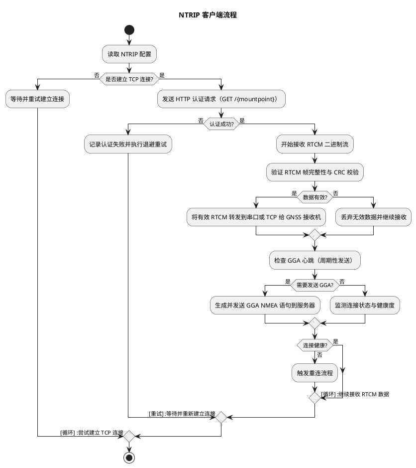
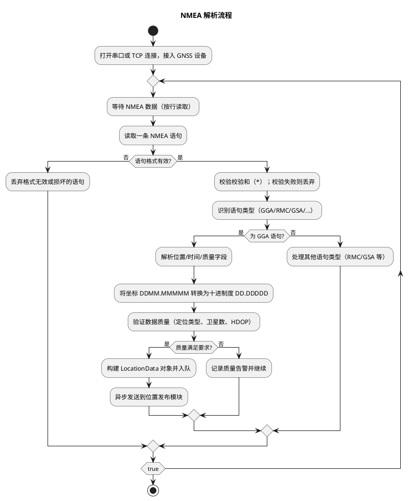
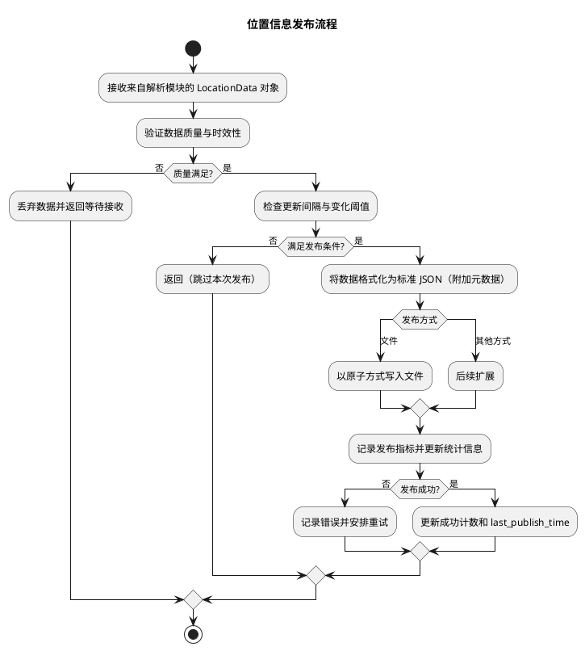
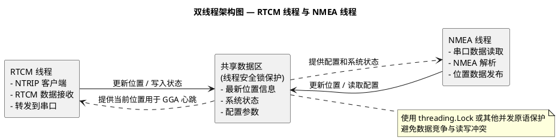

# RTK GNSS Worker详细设计文档

## 1. 文档概述

### 1.1 文档目的
本文档针对RTK GNSS Worker的实时厘米级定位服务功能进行详细设计，明确功能拆解、子功能逻辑、输入输出及处理流程，为后续Python代码开发、测试及维护提供依据，确保功能满足无人机、农业自动化、测绘等领域的高精度定位需求（含NTRIP差分数据接收、NMEA数据解析、位置信息发布）。

### 1.2 适用范围
- **软件模块**：RTK GNSS Worker定位服务模块（Python开发）
- **运行环境**：Ubuntu 22.04 LTS（64位）/ Windows 10+ / Docker容器化
- **依赖条件**：Python 3.8+，支持串口通信库（pyserial）、网络通信库（requests）、实时数据处理

### 1.3 技术栈说明

| 技术类别 | 具体工具/库 | 用途 |
|---------|------------|------|
| 操作系统 | Ubuntu 22.04 LTS / Windows 10+ | 软件运行基础环境 |
| 开发语言 | Python 3.8+ | 功能逻辑实现 |
| 网络通信 | requests、socket | NTRIP服务器连接、差分数据传输 |
| 串口通信 | pyserial | GNSS接收机数据交互 |
| 数据解析 | re、struct | NMEA协议解析、RTCM数据处理 |
| 线程管理 | threading | 双线程并行处理架构 |
| 数据交互 | JSON、queue | 位置数据结构化存储与传输 |
| 容器化 | Docker、docker-compose | 标准化部署和测试环境 |
| 日志系统 | logging | 统一日志管理和问题追踪 |

## 2. 功能需求分析

### 2.1 核心需求
RTK GNSS Worker需实现三类核心定位服务功能：

1. **NTRIP差分数据接收**：连接CORS基站或移动运营商NTRIP服务，实时接收RTCM差分修正数据，确保厘米级定位精度；

2. **NMEA数据实时解析**：解析GNSS接收机输出的NMEA语句，提取高精度位置、时间、质量等关键信息，支持多星座定位系统；

3. **位置信息标准化发布**：将解析后的位置数据标准化输出为JSON格式，支持文件、网络、回调等多种发布方式，满足不同应用场景需求。

### 2.2 功能边界
- **输入**：NTRIP服务器配置、串口设备配置、输出格式配置
- **输出**：实时位置数据（JSON格式）、系统状态报告、运行日志
- **不包含**：GNSS接收机硬件驱动、地图服务集成、坐标系转换（仅提供WGS84坐标）

## 3. 子功能详细设计

基于核心需求，将"RTK GNSS Worker定位服务"功能拆解为3个子功能，各子功能按"背景→输入→处理→输出"结构设计。

### 3.1 NTRIP差分数据接收功能

#### 3.1.1 背景
RTK定位的核心是通过差分修正消除GPS信号传播误差。NTRIP（Networked Transport of RTCM via Internet Protocol）协议允许通过互联网实时获取基站的RTCM差分数据。若缺乏稳定的差分数据源，定位精度将从厘米级降至米级，无法满足精准农业、无人驾驶等应用需求。

#### 3.1.2 输入

| 输入项 | 数据类型 | 来源 | 说明 |
|--------|----------|------|------|
| NTRIP服务器配置 | Dict | 配置文件（config.json） | 包含服务器地址、端口、用户名、密码、挂载点等信息 |
| 连接参数配置 | Dict | 配置文件 | 超时时间、重连间隔、最大重试次数等连接控制参数 |
| GGA心跳配置 | Dict | 配置文件 | GGA语句发送间隔（默认30秒），用于向基站报告接收机位置 |
| 当前位置信息 | LocationData | NMEA解析子功能 | 用于生成GGA心跳语句，告知基站接收机位置 |

#### 3.1.3 处理

##### 3.1.3.1 处理逻辑

1. **连接初始化**：
   - 解析NTRIP服务器配置，构建HTTP请求头（包含用户认证信息）
   - 建立TCP连接到NTRIP Caster，发送HTTP GET请求
   - 验证服务器响应，确认挂载点可用性和数据格式

2. **认证和握手**：
   - 发送HTTP基础认证头：`Authorization: Basic base64(username:password)`
   - 请求特定挂载点的数据流：`GET /MOUNTPOINT HTTP/1.1`
   - 处理服务器响应码（200成功，401认证失败，404挂载点不存在）

3. **RTCM数据接收**：
   - 建立持久TCP连接，持续接收二进制RTCM数据流
   - 解析RTCM帧头，验证数据完整性（CRC校验）
   - 将有效RTCM数据写入串口，转发给GNSS接收机

4. **GGA心跳维护**：
   - 每30秒向基站发送包含当前位置的GGA语句
   - 根据最新解析的位置数据生成标准NMEA GGA格式
   - 维持与基站的活跃连接，确保差分数据持续传输

5. **连接监控和恢复**：
   - 监测TCP连接状态，检测断线或数据中断
   - 实现指数退避重连机制，避免频繁重连对服务器造成压力
   - 记录连接状态变化和数据传输统计信息

##### 3.1.3.2 流程图



#### 3.1.4 输出

| 输出项 | 数据类型 | 格式示例（JSON） | 接收方 |
|--------|----------|------------------|--------|
| RTCM差分数据 | Binary | 二进制流（直接写入串口） | GNSS接收机硬件 |
| 连接状态报告 | Dict | `{"connected": true, "server": "120.253.226.97:8002", "mountpoint": "RTCM33_GRCEJ", "data_rate": "1.2KB/s", "last_data_time": "2024-10-01 15:30:00"}` | 系统监控模块、日志系统 |
| 认证失败日志 | Str | "2024-10-01 15:30:00: NTRIP认证失败，检查用户名密码" | 本地日志文件（log/ntrip_client.log） |

### 3.2 NMEA数据实时解析功能

#### 3.2.1 背景
GNSS接收机通过串口输出NMEA格式的定位数据，包含位置、时间、卫星信息、定位质量等关键参数。NMEA协议有多种语句类型（GGA、RMC、GSA等），需要准确解析并提取有效信息，同时进行数据质量验证，确保输出位置的可靠性。

#### 3.2.2 输入

| 输入项 | 数据类型 | 来源 | 说明 |
|--------|----------|------|------|
| 串口配置参数 | Dict | 配置文件 | 包含串口设备路径、波特率、超时时间等参数 |
| NMEA数据流 | String | GNSS接收机串口 | 标准NMEA 0183格式的ASCII文本流 |
| 数据质量阈值 | Dict | 配置文件 | 最小卫星数量、最小定位质量、HDOP阈值等质量控制参数 |
| 解析配置 | Dict | 配置文件 | 支持的NMEA语句类型、坐标格式、时间格式等解析选项 |

#### 3.2.3 处理

##### 3.2.3.1 处理逻辑

1. **串口连接管理**：
   - 根据配置参数打开串口连接（设备路径、波特率、数据位、停止位）
   - 设置读取超时和缓冲区大小，优化数据接收性能
   - 支持TCP模式（用于网络设备或虚拟串口）

2. **NMEA语句识别和分离**：
   - 逐行读取串口数据，按换行符分离NMEA语句
   - 识别语句类型（$GNGGA、$GNRMC、$GPGSA等）
   - 验证语句格式和校验和，丢弃损坏的数据

3. **GGA语句解析（主要位置信息）**：
   - 提取UTC时间、纬度、经度、高度信息
   - 解析定位质量指示器（0=无效，1=GPS，2=DGPS，4=RTK固定解，5=RTK浮动解）
   - 提取卫星数量、HDOP（水平精度稀释）、天线高度等质量参数

4. **坐标格式转换**：
   - 将NMEA格式的度分（DDMM.MMMMM）转换为十进制度（DD.DDDDD）
   - 处理南北纬、东西经标识，确保坐标符号正确
   - 支持WGS84坐标系输出

5. **数据质量验证**：
   - 检查定位质量是否满足最小要求（RTK固定解优先）
   - 验证卫星数量是否达到设定阈值（默认≥4颗）
   - 检查HDOP值是否在合理范围内（<2.0为良好）

6. **时间戳标准化**：
   - 将NMEA时间（HHMMSS.SSS）转换为Unix时间戳
   - 处理日期翻转和时区转换
   - 确保时间戳的连续性和准确性

##### 3.2.3.2 流程图



#### 3.2.4 输出

| 输出项 | 数据类型 | 格式示例（JSON） | 接收方 |
|--------|----------|------------------|--------|
| 位置数据对象 | LocationData | `{"timestamp": 1727780400.0, "latitude": 31.82061667, "longitude": 117.11521833, "altitude": 50.0, "quality": 4, "satellites": 20, "hdop": 0.6, "raw_nmea": "$GNGGA,123456.00,3149.2369,N,11706.9131,E,4,20,0.6,50.0,M,-3.2,M,1.5,0001*73"}` | 位置发布子功能、NTRIP客户端（GGA心跳） |
| 解析错误日志 | Str | "2024-10-01 15:30:00: NMEA校验和错误，期望73，实际0D" | 本地日志文件（log/nmea_parser.log） |
| 质量告警信息 | Dict | `{"timestamp": "2024-10-01 15:30:00", "warning_type": "low_satellite_count", "satellite_count": 3, "threshold": 4}` | 系统监控模块、告警系统 |

### 3.3 位置信息标准化发布功能

#### 3.3.1 背景
解析后的位置数据需要以标准化格式提供给不同的应用系统（监控平台、数据分析、导航应用等）。不同应用场景对数据格式、更新频率、传输方式有不同要求，需要支持多种发布方式，确保数据的实时性和可靠性。

#### 3.3.2 输入

| 输入项 | 数据类型 | 来源 | 说明 |
|--------|----------|------|------|
| 位置数据对象 | LocationData | NMEA解析子功能 | 包含时间戳、坐标、质量信息的结构化数据 |
| 发布配置 | Dict | 配置文件 | 输出类型、文件路径、网络地址、更新间隔等配置参数 |
| 数据格式模板 | Dict | 配置文件 | JSON输出格式、字段映射、精度设置等格式化选项 |
| 质量过滤条件 | Dict | 配置文件 | 最小质量要求、更新间隔控制、重复数据过滤等条件 |

#### 3.3.3 处理

##### 3.3.3.1 处理逻辑

1. **数据预处理**：
   - 接收来自NMEA解析模块的位置数据对象
   - 验证数据完整性和时间戳有效性
   - 应用质量过滤条件，丢弃不满足要求的数据

2. **更新频率控制**：
   - 实现基于时间间隔的发布控制（默认1秒间隔）
   - 避免高频数据导致的系统负载和日志冗余
   - 支持按数据变化阈值触发发布（位置变化>1米）

3. **数据格式化**：
   - 将LocationData对象转换为标准JSON格式
   - 添加时间戳、数据源标识、版本信息等元数据
   - 支持坐标精度设置（默认6位小数）和单位转换

4. **多方式发布**：
   - **文件输出**：原子写入JSON文件，避免读取时数据不完整
   - **网络发布**：HTTP POST到指定API端点
   - **回调函数**：支持自定义处理函数注册
   - **消息队列**：发布到Redis、RabbitMQ等消息中间件

5. **发布状态监控**：
   - 记录发布成功/失败统计信息
   - 监控文件写入权限、网络连接状态
   - 实现失败重试机制和错误恢复

6. **历史数据管理**：
   - 可选的轨迹数据保存功能
   - 实现日志轮转和存储空间管理
   - 支持数据压缩和归档

##### 3.3.3.2 流程图



#### 3.3.4 输出

| 输出项 | 数据类型 | 格式示例（JSON） | 接收方 |
|--------|----------|------------------|--------|
| 标准位置数据 | JSON | `{"timestamp": "2024-10-01T15:30:00.000Z", "location": {"latitude": 31.820617, "longitude": 117.115218, "altitude": 50.0}, "quality": {"fix_type": "RTK_FIXED", "satellites": 20, "hdop": 0.6}, "source": "rtk_gnss_worker", "version": "1.0.0"}` | 应用系统、数据库、监控平台 |
| 发布状态报告 | Dict | `{"total_published": 1024, "success_rate": 99.8, "last_publish_time": "2024-10-01T15:30:00.000Z", "failed_count": 2, "current_file": "/tmp/gnss_location.json"}` | 系统监控模块、运维平台 |
| 发布失败日志 | Str | "2024-10-01 15:30:00: 文件写入失败，权限不足：/tmp/gnss_location.json" | 本地日志文件（log/location_publisher.log） |

## 4. 关键技术实现说明

### 4.1 NTRIP协议实现细节

#### 4.1.1 HTTP认证机制
```python
def create_ntrip_request(server, port, mountpoint, username, password):
    """
    创建NTRIP HTTP请求
    """
    # Base64编码用户认证
    auth_string = f"{username}:{password}"
    auth_bytes = base64.b64encode(auth_string.encode('utf-8'))
    auth_header = f"Basic {auth_bytes.decode('utf-8')}"
    
    # 构建HTTP请求
    request = f"GET /{mountpoint} HTTP/1.1\r\n"
    request += f"Host: {server}:{port}\r\n"
    request += f"Authorization: {auth_header}\r\n"
    request += "User-Agent: RTK-GNSS-Worker/1.0\r\n"
    request += "Connection: close\r\n\r\n"
    
    return request.encode('utf-8')
```

#### 4.1.2 RTCM数据帧解析
```python
def parse_rtcm_frame(data):
    """
    解析RTCM数据帧
    """
    if len(data) < 3:
        return None
    
    # RTCM帧头：0xD3
    if data[0] != 0xD3:
        return None
    
    # 提取帧长度
    frame_length = ((data[1] & 0x03) << 8) | data[2]
    
    if len(data) < frame_length + 6:  # 帧头3字节 + 数据 + CRC24 3字节
        return None
    
    # 验证CRC24校验和
    frame_data = data[:frame_length + 3]
    crc_calculated = calculate_crc24(frame_data)
    crc_received = int.from_bytes(data[frame_length + 3:frame_length + 6], 'big')
    
    if crc_calculated != crc_received:
        return None
    
    return frame_data
```

### 4.2 NMEA协议解析算法

#### 4.2.1 校验和计算
```python
def calculate_nmea_checksum(sentence):
    """
    计算NMEA语句校验和
    """
    checksum = 0
    # 从$后开始，到*前结束
    for char in sentence[1:sentence.find('*')]:
        checksum ^= ord(char)
    return f"{checksum:02X}"

def verify_nmea_checksum(sentence):
    """
    验证NMEA语句校验和
    """
    if '*' not in sentence:
        return False
    
    parts = sentence.split('*')
    if len(parts) != 2:
        return False
    
    expected_checksum = calculate_nmea_checksum(parts[0] + '*')
    actual_checksum = parts[1].strip()
    
    return expected_checksum == actual_checksum.upper()
```

#### 4.2.2 GGA语句解析
```python
def parse_gga_sentence(sentence):
    """
    解析NMEA GGA语句
    """
    fields = sentence.split(',')
    if len(fields) < 15 or fields[0] != '$GNGGA':
        return None
    
    try:
        # 解析时间
        time_str = fields[1]
        utc_time = parse_nmea_time(time_str)
        
        # 解析纬度
        lat_str = fields[2]
        lat_dir = fields[3]
        latitude = parse_nmea_coordinate(lat_str, lat_dir)
        
        # 解析经度
        lon_str = fields[4]
        lon_dir = fields[5]
        longitude = parse_nmea_coordinate(lon_str, lon_dir)
        
        # 解析其他字段
        quality = int(fields[6]) if fields[6] else 0
        satellites = int(fields[7]) if fields[7] else 0
        hdop = float(fields[8]) if fields[8] else 0.0
        altitude = float(fields[9]) if fields[9] else 0.0
        
        return LocationData(
            timestamp=utc_time,
            latitude=latitude,
            longitude=longitude,
            altitude=altitude,
            quality=quality,
            satellites=satellites,
            hdop=hdop,
            raw_nmea=sentence
        )
    except (ValueError, IndexError):
        return None
```

### 4.3 双线程架构设计

#### 4.3.1 线程架构图


#### 4.3.2 线程同步机制
```python
class GNSSWorker:
    def __init__(self, config):
        self.config = config
        self.running = False
        self.last_location = None
        
        # 线程安全锁
        self._location_lock = threading.Lock()
        
        # 工作线程
        self._rtcm_thread = None
        self._nmea_thread = None
    
    def _rtcm_worker(self):
        """RTCM数据处理线程"""
        while self.running:
            try:
                # 接收RTCM数据
                rtcm_data = self.ntrip_client.receive_rtcm(timeout=1.0)
                if rtcm_data:
                    self.serial_handler.write_rtcm(rtcm_data)
                
                # 发送GGA心跳
                with self._location_lock:
                    current_location = self.last_location
                
                if current_location and self._should_send_gga():
                    gga_sentence = self._generate_gga(current_location)
                    self.ntrip_client.send_gga(gga_sentence)
                    
            except Exception as e:
                self.logger.error(f"RTCM worker error: {e}")
                time.sleep(1)
    
    def _nmea_worker(self):
        """NMEA数据处理线程"""
        while self.running:
            try:
                # 读取NMEA数据
                nmea_line = self.serial_handler.read_nmea(timeout=1.0)
                if nmea_line:
                    location = self.nmea_parser.parse(nmea_line)
                    if location:
                        # 线程安全更新位置
                        with self._location_lock:
                            self.last_location = location
                        
                        # 发布位置数据
                        self.location_publisher.publish(location)
                        
            except Exception as e:
                self.logger.error(f"NMEA worker error: {e}")
                time.sleep(1)
```

### 4.4 原子文件写入机制

```python
def atomic_write_json(file_path, data):
    """
    原子性写入JSON文件，避免读取时数据不完整
    """
    import tempfile
    import os
    import json
    
    # 在同一目录创建临时文件
    temp_fd, temp_path = tempfile.mkstemp(
        suffix='.tmp',
        dir=os.path.dirname(file_path)
    )
    
    try:
        # 写入临时文件
        with os.fdopen(temp_fd, 'w', encoding='utf-8') as f:
            json.dump(data, f, indent=2, ensure_ascii=False)
            f.flush()
            os.fsync(f.fileno())  # 强制写入磁盘
        
        # 原子性替换
        if os.name == 'nt':  # Windows
            if os.path.exists(file_path):
                os.remove(file_path)
        os.rename(temp_path, file_path)
        
    except Exception:
        # 清理临时文件
        try:
            os.unlink(temp_path)
        except OSError:
            pass
        raise
```

## 5. 接口设计

### 5.1 内部接口（子功能间）

| 接口名称 | 调用方 | 被调用方 | 数据格式（JSON） |
|----------|--------|----------|------------------|
| 位置数据传递接口 | NMEA解析子功能 | 位置发布子功能 | 同"子功能2输出-位置数据对象" |
| GGA心跳生成接口 | NTRIP客户端子功能 | NMEA解析子功能 | `{"request_type": "current_location", "timestamp": "2024-10-01T15:30:00.000Z"}` |
| 系统状态查询接口 | 位置发布子功能 | 全局状态管理 | `{"ntrip_connected": true, "serial_open": true, "last_location_time": "2024-10-01T15:30:00.000Z"}` |

### 5.2 外部接口（与其他模块）

| 接口名称 | 调用方 | 被调用方 | 数据格式（JSON） |
|----------|--------|----------|------------------|
| 配置更新接口 | 外部管理系统 | RTK GNSS Worker | `{"ntrip": {"server": "new-server.com", "username": "new_user"}, "output": {"update_interval": 0.5}}` |
| 位置数据订阅接口 | 外部应用系统 | 位置发布子功能 | 同"子功能3输出-标准位置数据" |
| 系统状态监控接口 | 监控平台 | RTK GNSS Worker | `{"status": "running", "uptime": 3600, "location_count": 1024, "error_count": 2}` |
| 告警通知接口 | RTK GNSS Worker | 告警系统 | `{"alert_type": "connection_lost", "severity": "warning", "message": "NTRIP连接中断", "timestamp": "2024-10-01T15:30:00.000Z"}` |

## 6. 测试要点

| 测试场景 | 测试步骤 | 预期结果 |
|----------|----------|----------|
| NTRIP连接正常建立 | 1. 配置正确的NTRIP服务器信息；2. 启动RTK GNSS Worker；3. 观察连接状态 | 成功连接NTRIP服务器，开始接收RTCM数据，连接状态为true |
| NTRIP认证失败处理 | 1. 配置错误的用户名密码；2. 启动服务；3. 观察错误处理 | 记录认证失败日志，启动重连机制，不影响其他功能 |
| NMEA数据解析准确性 | 1. 发送标准GGA语句到串口；2. 观察解析结果；3. 验证坐标精度 | 正确解析纬度、经度、高度、质量信息，坐标精度达到6位小数 |
| 校验和错误处理 | 1. 发送校验和错误的NMEA语句；2. 观察处理结果 | 丢弃错误数据，记录解析错误日志，不影响后续数据处理 |
| 位置数据发布频率控制 | 1. 配置1秒发布间隔；2. 高频发送位置数据；3. 监控实际发布频率 | 按配置间隔发布数据，避免高频发布导致的性能问题 |
| 文件原子写入验证 | 1. 高频读写位置文件；2. 并发读取文件内容；3. 验证数据完整性 | 文件内容始终完整，无读取到部分写入的情况 |
| 系统异常恢复能力 | 1. 人为断开网络连接；2. 重新连接网络；3. 观察系统恢复 | 自动重连NTRIP服务器，恢复正常工作，无数据丢失 |
| 双线程架构稳定性 | 1. 长时间运行（24小时）；2. 监控内存使用；3. 观察线程状态 | 内存使用稳定，无内存泄漏，双线程正常工作 |

## 7. 部署和运维

### 7.1 系统要求

| 组件 | 最低要求 | 推荐配置 |
|------|----------|----------|
| 操作系统 | Ubuntu 18.04+ / Windows 10+ | Ubuntu 22.04 LTS |
| Python版本 | Python 3.8+ | Python 3.11+ |
| 内存 | 256MB | 512MB |
| 存储空间 | 100MB | 1GB（含日志） |
| 网络带宽 | 10KB/s | 50KB/s |
| 串口 | USB/RS232串口 | USB 3.0接口 |

### 7.2 部署方式

#### 7.2.1 Docker部署（推荐）
```bash
# 1. 拉取镜像
docker pull rtk-gnss-worker:latest

# 2. 运行容器
docker run -d \
  --name rtk-worker \
  --device=/dev/ttyUSB0 \
  -e GNSS_NTRIP_SERVER=your-cors.com \
  -e GNSS_NTRIP_USERNAME=your-user \
  -e GNSS_NTRIP_PASSWORD=your-pass \
  -v /tmp:/tmp \
  rtk-gnss-worker:latest
```

#### 7.2.2 tar包部署
```bash
# 1. 解压发布包
tar -zxvf rtk-gnss-worker-1.0.0.tar.gz
cd rtk-gnss-worker-1.0.0

# 2. 运行部署脚本
./deploy.sh

# 3. 启动服务
./start.sh
```

### 7.3 监控指标

| 监控项 | 指标说明 | 告警阈值 |
|--------|----------|----------|
| NTRIP连接状态 | 连接是否正常 | 连接中断>30秒 |
| 数据接收速率 | RTCM数据接收速率 | <0.5KB/s持续60秒 |
| 位置更新频率 | 位置数据更新频率 | <0.5Hz持续60秒 |
| 定位质量 | RTK固定解比例 | <80%持续300秒 |
| 内存使用率 | 进程内存占用 | >80% |
| 磁盘使用率 | 日志目录磁盘占用 | >90% |

## 8. 附录

### 8.1 配置文件示例（config.json）

```json
{
    "ntrip": {
        "server": "120.253.226.97",
        "port": 8002,
        "username": "cvhd7823",
        "password": "n8j5c88f",
        "mountpoint": "RTCM33_GRCEJ",
        "timeout": 30.0,
        "reconnect_interval": 5,
        "max_retries": 3
    },
    "serial": {
        "port": "/dev/ttyUSB0",
        "baudrate": 115200,
        "timeout": 1.0,
        "host": null
    },
    "output": {
        "type": "file",
        "file_path": "/tmp/gnss_location.json",
        "atomic_write": true,
        "update_interval": 1.0
    },
    "logging": {
        "level": "INFO",
        "file": "/var/log/rtk-gnss-worker.log",
        "max_size": "10MB",
        "backup_count": 5
    },
    "positioning": {
        "min_satellites": 4,
        "min_quality": 1,
        "gga_interval": 30,
        "position_timeout": 60
    }
}
```

### 8.2 环境变量配置

| 环境变量 | 默认值 | 说明 |
|----------|--------|------|
| GNSS_NTRIP_SERVER | localhost | NTRIP服务器地址 |
| GNSS_NTRIP_PORT | 2101 | NTRIP服务器端口 |
| GNSS_NTRIP_USERNAME | test | NTRIP用户名 |
| GNSS_NTRIP_PASSWORD | test | NTRIP密码 |
| GNSS_NTRIP_MOUNTPOINT | TEST | NTRIP挂载点 |
| GNSS_SERIAL_PORT | /dev/ttyUSB0 | 串口设备路径 |
| GNSS_SERIAL_BAUDRATE | 115200 | 串口波特率 |
| GNSS_OUTPUT_FILE | /tmp/gnss_location.json | 位置数据输出文件 |
| GNSS_LOG_LEVEL | INFO | 日志级别 |

### 8.3 日志文件路径

- **主日志文件**：`/var/log/rtk-gnss-worker.log`
- **NTRIP客户端日志**：`logs/ntrip_client.log`
- **NMEA解析日志**：`logs/nmea_parser.log`
- **位置发布日志**：`logs/location_publisher.log`
- **系统错误日志**：`logs/error.log`

### 8.4 常见问题排查

| 问题现象 | 可能原因 | 解决方案 |
|----------|----------|----------|
| NTRIP连接失败 | 网络不通、认证信息错误 | 检查网络连接，验证用户名密码 |
| 串口打开失败 | 设备不存在、权限不足 | 检查设备路径，添加用户到dialout组 |
| 位置数据不更新 | GNSS接收机无信号、串口故障 | 检查天线连接，验证串口通信 |
| 定位精度差 | 差分数据中断、信号遮挡 | 检查NTRIP连接，改善接收环境 |
| 内存占用增长 | 日志文件过大、数据积累 | 配置日志轮转，清理临时文件 |

---

**文档版本**：v1.0.0  
**最后更新**：2025年9月1日  
**维护人员**：RTK GNSS Worker开发团队
