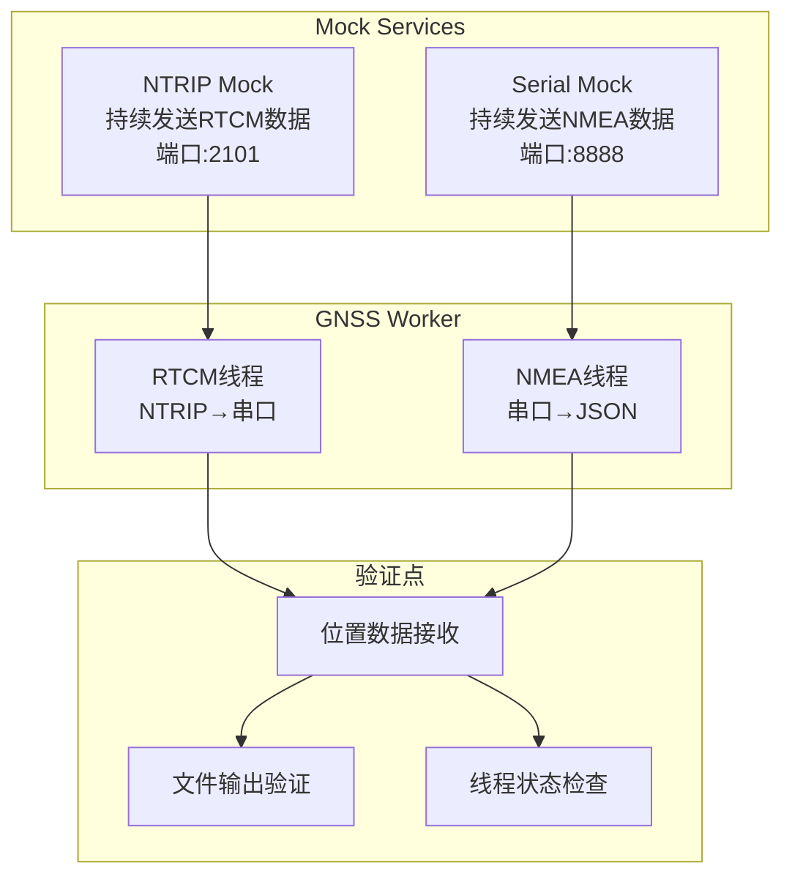

# RTK GNSS Worker Docker测试环境

本目录提供**完整的容器化测试环境**，包括真正的端到端集成测试。

## 🐳 Docker独立测试

### 一键测试（推荐）
```bash
# 运行完整的Docker测试套件
./run_docker_test.sh
```

### 容器内测试类型
```bash
# 在容器内运行特定测试
docker exec -it rtk-test python run_tests.py --type architecture     # 架构测试
docker exec -it rtk-test python run_tests.py --type unit            # 单元测试  
docker exec -it rtk-test python run_tests.py --type integration     # 集成测试（含mock和真实）
docker exec -it rtk-test python run_tests.py --type real-integration # 真正的端到端测试 🆕
docker exec -it rtk-test python run_tests.py --type all             # 全部测试
```

## 🚀 真正的端到端集成测试 🆕

### 测试架构


### 测试内容
- ✅ **真实数据流**：使用实际的NTRIP和串口mock服务
- ✅ **双线程验证**：验证RTCM和NMEA线程独立工作
- ✅ **端到端数据**：从RTCM接收到位置输出的完整流程
- ✅ **连接状态**：验证所有服务连接正常
- ✅ **数据质量**：验证接收到的位置数据格式和内容

## 📁 测试文件组织

### 🏗️ 架构测试（双线程验证）
- **`test_architecture.py`** - 双线程架构结构验证
- **`test_dual_thread.py`** - 双线程功能测试

### 🔧 单元测试
- **`test_units.py`** - 核心组件单元测试
- **`test_gnss_worker.py`** - 主工作器测试
- **`test_ntrip_client.py`** - NTRIP客户端测试

### 🔗 集成测试
- **`test_integration.py`** - 组件集成测试
- **`test_real_ntrip.py`** - 真实环境测试

### ⚙️ 配置测试
- **`test_unified_config.py`** - 统一配置系统测试

## 🛠️ Docker测试环境

### 目录结构
```
tests/
├── Dockerfile.unified          # Docker镜像定义 🆕
├── docker-compose.unified.yml  # 测试编排配置
├── run_docker_test.sh          # Docker测试脚本
├── run_tests.py                # 容器内测试运行器
├── entrypoint.sh               # 容器入口脚本
├── test_architecture.py        # 双线程架构测试 🆕
├── test_dual_thread.py         # 双线程功能测试 🆕
├── test_*.py                   # 其他测试文件
├── config.json/                # 测试配置
├── logs/                       # 测试日志
└── output/                     # 测试输出
```

### 核心特性
- ✅ 完全容器化的测试环境
- ✅ 隔离的依赖和配置
- ✅ 一键运行所有测试
- ✅ 详细的测试报告
- ✅ 支持CI/CD集成

## 🚫 不支持本地测试

> **重要**：此项目专注于Docker容器化测试，不提供本地Python测试支持。
> 所有测试都应该在Docker容器内运行，确保环境一致性。

如需测试，请使用：
```bash
./run_docker_test.sh  # 唯一推荐的测试方式
```
